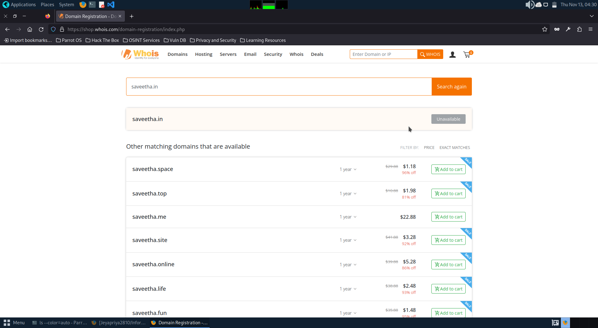
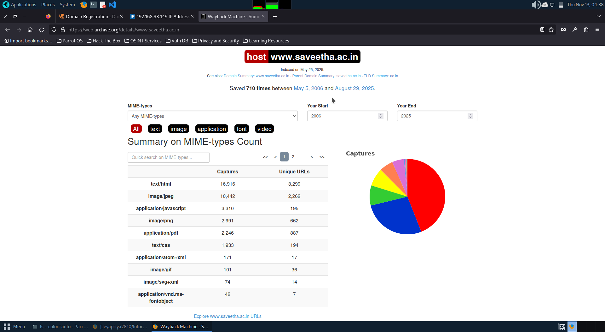
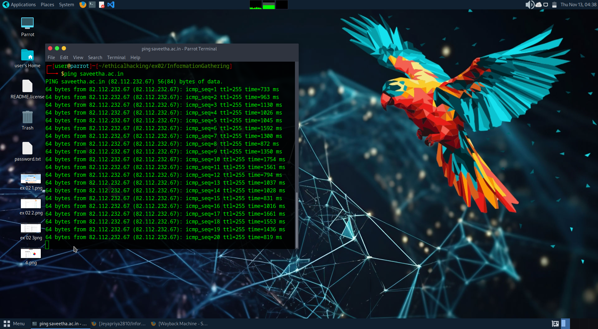
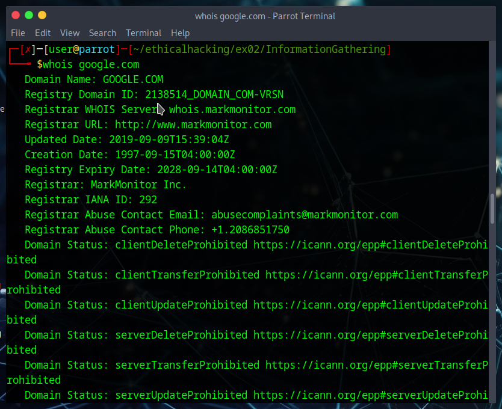

# InformationGathering
Information Gathering Techiques

# To perform information gathering techniques

# AIM:

To perform information gathering techniques using kali linux 

## STEPS:

### Step 1:

Install kali linux either in partition or virtual box or in live mode

### Step 2:

Investigate on the various categories of tools as follows:

### Step 3:
Open terminal/browser and try execute necessary  commands/use url to perform information

## OUTPUT:
http://www.whois.com/whois website to get detailed information about a domain name information including its owner, its registrar, date of registration, expiry, name server, owner's contact information, etc.

ping command is available on Windows as well as on Linux OS. Following is the example to find out the IP address of facebook.com.

ip2location.com

ping

whois

traceroute t

nmap

 whatweb

sudo traceroute -T www.google.com 6 Alt text
## RESULT:
The information gathering techniques tools/procedure were  identified successfully
